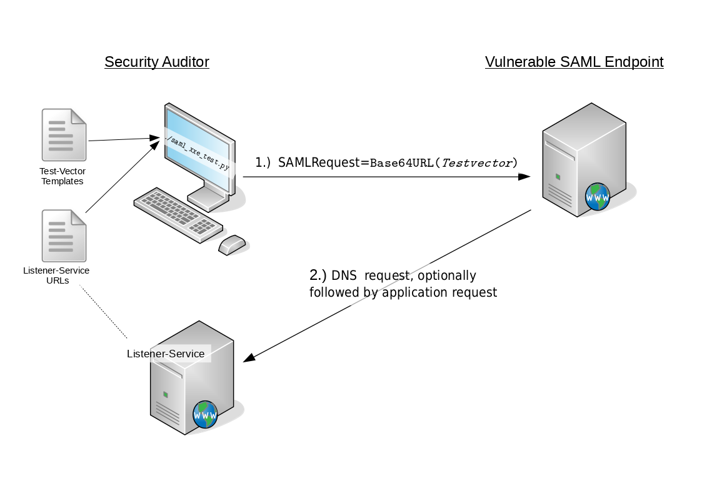

# SAML-XXE-Test
A simple XXE test suite generated specifically for SAML interfaces. 
## Introduction
[SAML](https://en.wikipedia.org/wiki/Security_Assertion_Markup_Language) is an XML based markup language and XML parsers employed by SAML endpoints may be susceptible to [XXE attacks](https://en.wikipedia.org/wiki/XML_external_entity_attack). However, SAML messages are usually transmitted using `Base64Url()` encoding and may additionally be deflate compressed (depending on the used SAML binding). This makes testing for XXE less trivial, as the encoding needs to be applied to each test-vector when evaluating a SAML endpoint regarding XXE vulnerabilities.
 
`saml_xxe_test.py` automatically performs the required encoding and additionally comes with a predefined set of default test-vectors, most of which attempt to provoke *out-of-band* feedback. Using `saml_xxe_test.py`, a security auditor can semi-automatically check a SAML endpoint for XXE vulnerabilities. In its simplest form, running `saml_xxe_test.py` only requires two arguments: 

```
./saml_xxe_test.py -f url_file.txt -t TARGET
```
Here, `url_file.txt` contains URLs of a listener service set up by the auditor and `TARGET` is replaced by the URL of the SAML endpoint under test. 

As indicated above, `saml_xxe_test.py` reads templates of test-vectors from a YAML file and generates a pool of test-vectors by combining the entity definitions of the templates with various protocol schemes, DTD keywords and provided URLs of a listener service controlled by the auditor. The generated test-vectors are subsequently send to the targeted SAML endpoint. Requests as well as responses are logged and the auditor can assess whether or not the tested service is vulnerable by watching out for incoming requests at the prepared listener service. This test scenario is depicted below.



## Usage Details

1. Set up a listener that waits for incoming requests from the service under test. This could simply be a web server if you only test the `http` scheme. 
2. Generate a file `url_file.txt` that contains -preferably unique- listener URLs, one per line<sup id="fn1"><b>[1](#fnc1)</b></sup>. The URLs must not contain a protocol scheme, i.e., use `localhost:5000/RANDOM-UUID` (note the missing `http://`) if the tested service and your listener are both running on `localhost` . Make sure your listener is bound to the ports used in `url_file.txt` and logs incoming requests. 
3. Using `Python 3`, run `./saml_xxe_test.py -f url_file.txt -t TARGET` This will start sending the default test vectors (`http` scheme only) as `SAMLRequest` parameter via `HTTP-POST Binding` to the SAML endpoint `TARGET`. If the service at `TARGET` is vulnerable (and has network access), your listener should receive a corresponding request. Incoming requests can easily be mapped to sent test-vectors if you use unique identifiers in the URLs listed in `url_file.txt`. 


### Options
`saml_xxe_test.py` allows to configure the following settings from the commandline.
```
./saml_xxe_test.py -h
usage: saml_xxe_test.py [-h] -f URL_FILE [-o OUTPUT_FILE] [-t TARGET]
                        [--vector_file VECTOR_FILE] [-m {POST,GET}] [-a]
                        [-p PROXY] [-d] [-i INTERVAL] [-v] [--timeout TIMEOUT]
                        [--dump_vectors] [-s {SAMLRequest,SAMLResponse}]
                        [--store_test STORE_TEST]

required arguments:
  -f URL_FILE, --url_file URL_FILE
                        Full path of Burp Collaborator URL File
  -t TARGET, --target TARGET
                        Target URL as SCHEME://IP:PORT, e.g.,
                        http://localhost:5000

optional arguments:
  -h, --help            show this help message and exit
  -o OUTPUT_FILE, --output_file OUTPUT_FILE
                        If no output file is defined, output to terminal is
                        enabled.
  --vector_file VECTOR_FILE
                        A yaml file containing a list of XXE Vectors, defaults
                        to ./default_phase1_vectors.yml The vectors may
                        contain the following placeholders:
                        "${PROTOCOLHANDLE}", "${SYSPUB}",
                        "${PUBLIC_URL_PLACEHOLDER}".
  -m {POST,GET}, --method {POST,GET}
                        Which HTTP method to use, default is POST. If set to
                        GET, deflate compression is applied to the SAML
                        message (HTTP-Redirect Binding)
  -a, --aggressive      Build vectors using more protocolhandlers
  -p PROXY, --proxy PROXY
                        Add http(s) proxy address as IP:PORT like
                        127.0.0.1:8080.
  -d, --debug           enable Debug mode
  -i INTERVAL, --interval INTERVAL
                        Set request interval delayin seconds. Default is a
                        random interval in (5, 15) seconds
  -v, --verbose         Enabled verbose mode puts response to stdout.Auto
                        enabled if not output file is specified
  --timeout TIMEOUT     Seconds to wait until a request is aborted as timed
                        out. Default is 30 seconds.
  --dump_vectors        Print generated DTD vectors and exit
  -s {SAMLRequest,SAMLResponse}, --samlparam {SAMLRequest,SAMLResponse}
                        The HTTP parametername to use, SAMLRequest if not
                        defined
  --store_test STORE_TEST
                        Store serialized response objects in given filename
                        (as python shelve). May be useful for later analysis.

```

### Todos

- Implement some kind of session macro to allows testing SAML endpoints that require a valid session before parsing XML (e.g., AssertionConsumerService that checks if the `RelayState` parameter is bound to a session cookie first).
- Integrate more closely with a listener service. As an example when using Burp Collaborator, poll for incoming requests and automate evaluation. Alternatively, an active scanner could be integrated into the [EsPReSSO extension](https://github.com/RUB-NDS/BurpSSOExtension)


### References

- OWASP has a site with [general information about XXE](https://www.owasp.org/index.php/XML_External_Entity_(XXE)_Processing)
- [**Countermeasures** against XXE](https://www.owasp.org/index.php/XML_External_Entity_(XXE)_Prevention_Cheat_Sheet) as recommended by OWASP
- To learn more about XXE in SAML, check out [https://web-in-security.blogspot.de/2014/11/detecting-and-exploiting-xxe-in-saml.html](https://web-in-security.blogspot.de/2014/11/detecting-and-exploiting-xxe-in-saml.html) 
- A comprehensive list of XXE vectors [https://web-in-security.blogspot.de/2016/03/xxe-cheat-sheet.html](https://web-in-security.blogspot.de/2016/03/xxe-cheat-sheet.html)

---
<em id="fnc1">Footnote 1:</em>  If you are using [Burp Collaborator](https://portswigger.net/burp/help/collaborator) as your listener, simply copy the required amount of Collaborator URLs into your `url_file.txt`. At the time of writing, Burp Collaborator supports a number of protocols including `http` and `https`.  [↩](#fn1)

